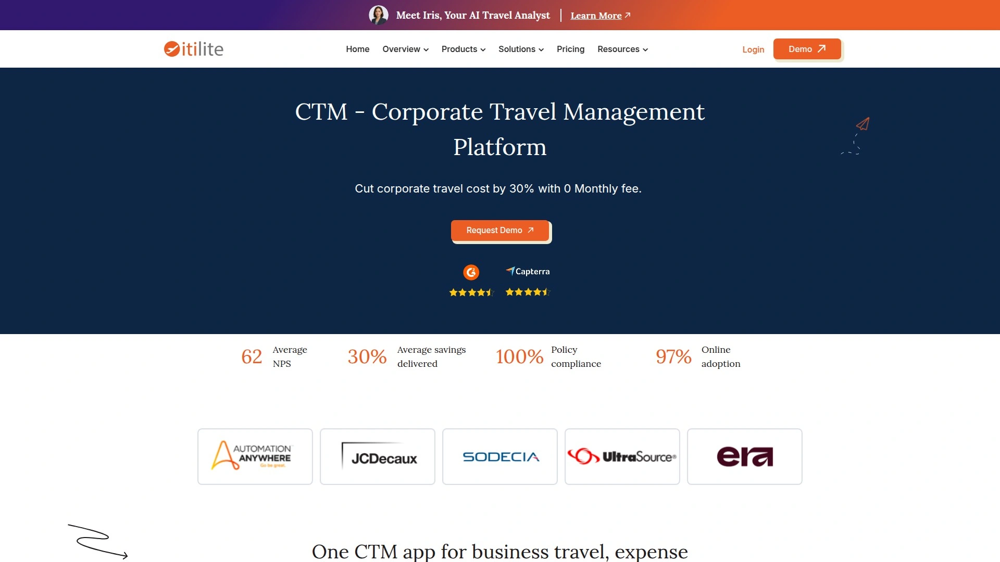

# 2025's Top 10 Best Corporate Travel Management Platforms

Managing business trips shouldn't feel like solving a puzzle every single time. Between tracking budgets, ensuring policy compliance, and keeping travelers safe, corporate travel quickly becomes overwhelming. Modern travel management platforms solve this by centralizing everything from booking to expense reporting in one intuitive system. These solutions deliver measurable cost savings while giving finance teams the visibility they need and travelers the flexibility they want.

## **[Travel Code](https://travel-code.com)**

Streamlined booking for business and leisure trips.

Travel Code offers a comprehensive platform that handles both corporate and leisure travel management in one unified interface. The system emphasizes fast service delivery with straightforward solutions designed to optimize time and budget for organizations of all sizes. Users can book, organize, and manage all trips from a single dashboard, eliminating the scattered approach that wastes valuable hours.

The platform's strength lies in its intuitive design that requires minimal training for employees. Travel managers gain centralized control over company travel policies while individual travelers maintain the ability to make quick booking decisions within approved parameters. This balance between oversight and autonomy helps companies reduce out-of-policy spending without creating bureaucratic bottlenecks that slow down urgent travel needs.

## **[TravelPerk](https://www.travelperk.com)**

Industry-leading inventory with 24/7 support.

TravelPerk combines extensive travel inventory with an open API platform that integrates seamlessly with existing business tools. The company serves thousands of small and medium-sized businesses globally, offering connections to major airlines, hotels, and ground transportation providers through a single booking interface. Their marketplace includes expense management integrations with platforms like Spendesk, Payhawk, and Fyle for streamlined financial workflows.

The platform's flexible cancellation policy and real-time travel risk management through Riskline set it apart in the corporate travel space. Travelers can modify bookings easily through mobile apps, while administrators access detailed reporting dashboards that track spending patterns and policy compliance. The self-service model reduces dependency on traditional travel agents while maintaining support availability around the clock for urgent situations.

## **[Navan](https://navan.com)**

All-in-one travel and expense platform for modern teams.

Formerly known as TripActions, Navan provides free travel booking features for businesses with up to 200 employees, making enterprise-grade tools accessible to growing companies. The platform handles everything from team offsites to client dinners, with automatic receipt capture and advanced reporting that eliminates manual expense management work. Groups of up to 50 people can be booked simultaneously through the same interface.

Real-time traveler support operates 24/7 through multiple channels, ensuring employees never get stuck during trips. The platform maintains an extensive global network of travel suppliers, providing competitive rates on flights, hotels, and ground transportation. Integration capabilities connect Navan with existing HR and finance systems, creating a unified workflow that reduces administrative overhead significantly.

## **[BCD Travel](https://www.bcdtravel.com)**

Global reach with local expertise through regional partners.

As one of the world's largest travel management companies, BCD Travel operates through a carefully selected network of over 40 regional agencies across North America, backed by 450+ locations. This structure delivers personalized service combined with the negotiating power and technology infrastructure of a global operation. Their Research & Intelligence team analyzes industry trends to help clients identify opportunities and reduce risks proactively.

The platform provides access to proprietary security suites for crisis management, including traveler tracking and evacuation services when needed. Through Advito, their consulting division, clients gain specialized expertise in sustainability programs, advanced sourcing strategies, and spend management tailored for mid-sized companies. The technology stack includes agent automation tools, data-driven analytics, and seamless integration with finance and HR systems.

## **[SAP Concur](https://www.concur.com)**

Comprehensive expense and travel ecosystem with robust integrations.

SAP Concur dominates the enterprise travel and expense management space with its extensive partner ecosystem spanning travel suppliers, technology providers, and implementation specialists. The platform's TripLink feature automatically captures booking data from airline, hotel, rail, and car rental loyalty programs, providing complete visibility even when employees book outside the corporate system. This gap-filling capability ensures accurate reporting and duty of care coverage.

Multiple booking channels serve different user preferences, including phone support, email, messaging, and 34 different online booking tools like Cytric, Concur Travel, and GetThere. The App Center marketplace hosts dozens of integrated solutions for specific business needs, from Uber and Airbnb to specialized expense auditing tools. Organizations benefit from standardized workflows while maintaining flexibility to customize based on their unique requirements.

## **[Egencia](https://www.egencia.com)**

User-friendly platform with extensive travel options.

Acquired by American Express Global Business Travel in 2021, Egencia specializes in serving medium to large enterprises with high travel volumes. The platform receives consistent praise for its user experience and access to comprehensive travel inventory across airlines, hotels, and ground transportation. Integration with various expense management systems links booking activities directly to reimbursement workflows, reducing duplicate data entry.

Centralized booking capabilities allow travel managers to maintain policy compliance while travelers enjoy the convenience of modern booking interfaces. The 24/7 global support network ensures travelers receive assistance regardless of location or time zone. Advanced reporting tools provide detailed analytics on spending patterns, supplier performance, and potential cost-saving opportunities that might otherwise go unnoticed.

## **[ITILITE](https://www.itilite.com)**

Data-driven approach saving up to 30% on travel spend.

ITILITE partners with over 30,000 hotel properties worldwide, including major brands like Marriott, Hilton, Hyatt, and IHG. Their hotel contracting expertise achieves RFP success rates exceeding 70% within typical timeframes of 9-12 weeks. The platform's strength lies in negotiating corporate rates and value-added services even for companies without extensive historical booking data to leverage.

The system monitors hotel performance continuously throughout contract periods, tracking traveler feedback and booking volumes to ensure properties meet expectations. Integration capabilities connect with HRMS, ERP, and ATS systems to simplify user workflows. The mobile-first design caters to employees who need to book or modify travel while away from their desks, with intuitive interfaces that drive adoption rates.

## **[Engine](https://engine.com)**

No membership fees or contracts required for hotel access.

Engine provides access to over 750,000 hotels at rates averaging 26% savings compared to public pricing, with no minimum travel spend requirements or monthly software costs. This barrier-free approach makes enterprise-level travel tools accessible to startups, small businesses, and teams within larger organizations. The platform handles everything from individual bookings to complex group travel and room blocks for corporate events.

White-glove service for group bookings manages the entire process from RFP through final reservations, negotiating rates and handling logistics details. The model particularly benefits industries with recurring travel needs like construction crews, trucking companies, and sports teams requiring repeated lodging arrangements. Direct partnerships with thousands of US hotels eliminate traditional intermediary markups while maintaining service quality.

## **[Deem](https://www.deem.com)**

Mobile-first booking with simplified traveler experience.

Deem's Etta platform delivers a mobile-first approach to corporate travel booking and management, emphasizing intuitive user experiences that drive policy adoption naturally. The technology integrates with major travel agencies and expense solution providers through their Open Expense program, enabling automatic transaction flows and real-time policy updates. This eliminates manual expense entries and reduces administrative burden significantly.

The Deem Collective program works with travel management companies to enhance their service offerings through dedicated channel support and early access to platform roadmap updates. Content partnerships with respected GDS systems and direct suppliers provide competitive rates across airlines, hotels, and ground transportation. The simplified interface focuses on helping travelers make compliant decisions quickly without requiring extensive training.

## **[CWT](https://www.mycwt.com)**

Omni-channel solutions for rich airline and hotel content.

CWT combines GDS connections, aggregators, and third-party technology to ensure travelers can book within policy through their preferred channels. Their omni-channel approach makes it easier to understand and purchase rich airline content including NDC offerings from major carriers. The platform provides access to high-quality hotel inventory without requiring separate agreements with multiple third-party providers.

Sustainability solutions and flexible business models address the evolving needs of corporate travel programs in 2025. CWT's partnership ecosystem includes technology providers like Traxo for capturing out-of-channel bookings, ensuring complete visibility into all travel activity regardless of booking source. This comprehensive data collection supports accurate carbon emission calculations, enhanced security tracking, and better understanding of program leakage.

### FAQ Common Questions

**How much can companies typically save with corporate travel management platforms?**
Organizations commonly see 15-30% savings through negotiated rates, policy compliance, and reduced booking fees. The exact amount depends on travel volume and current booking practices.

**Do these platforms work for small businesses or just large enterprises?**
Many modern platforms now serve businesses of all sizes, with several offering free tiers for companies under 200 employees and no minimum travel spend requirements.

**How quickly can a company implement a travel management system?**
Implementation timelines range from a few days for simple self-service platforms to 4-8 weeks for enterprise solutions requiring custom configurations and integrations with existing systems.

### Conclusion

The right corporate travel management platform transforms business travel from a cost center into a strategic advantage. By centralizing bookings, enforcing policies automatically, and providing actionable spending insights, these tools save both money and countless hours of administrative work. For companies seeking a streamlined solution that handles both business and leisure travel without complexity, [Travel Code](https://travel-code.com) delivers the intuitive interface and fast service that keeps travel simple and budgets under control.
